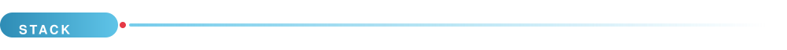
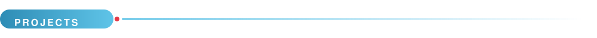
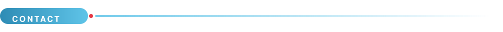
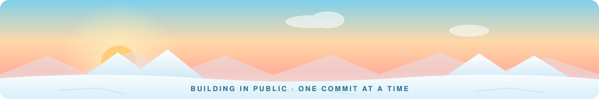

<picture>
  <source media="(prefers-color-scheme: dark)" srcset="assets/banner-dark.svg">
  <source media="(prefers-color-scheme: light)" srcset="assets/banner-light.svg">
  
</picture>

  

Full-stack developer specialised in **digital forensics**.
I work from low-level systems up to polished interfaces, and I care about
minimal dependencies, reproducible builds and privacy-respecting architecture.

 

 

<b>LANGUAGES</b>
 

  

<b>FRONTEND</b>
 

  

<b>BACKEND &amp; INFRASTRUCTURE</b>
 

 

<table width="100%">
<tr>
<td width="50%" valign="top">

### [Seca](https://github.com/arditore/Seca)

Contacts, phone and messages for Android — one coherent
replacement for the three apps you use every day.

- Material 3 Expressive design
- Zero Google dependencies
- End-to-end encrypted messaging between Seca phones
- Written in Kotlin

</td>
<td width="50%" valign="top">

### [arditore.github.io](https://arditore.github.io/)

A personal site that sends nothing anywhere. Static,
bilingual, and tested to stay that way.

- No analytics, cookies or third-party requests
- Self-hosted fonts, inlined SVG logos, ~600 bytes of JS
- Light and dark are polar day and polar night
- Built with Astro; CI blocks any privacy regression

</td>
</tr>
</table>

<i>Writing about vulnerability research on the blog — in English and French.</i>

 

  

<picture>
  <source media="(prefers-color-scheme: dark)" srcset="assets/footer-dark.svg">
  <source media="(prefers-color-scheme: light)" srcset="assets/footer-light.svg">
  
</picture>

